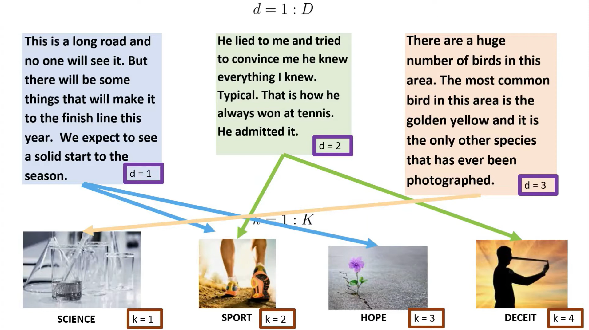
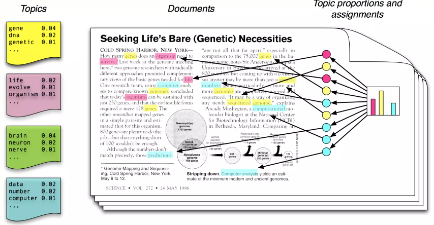
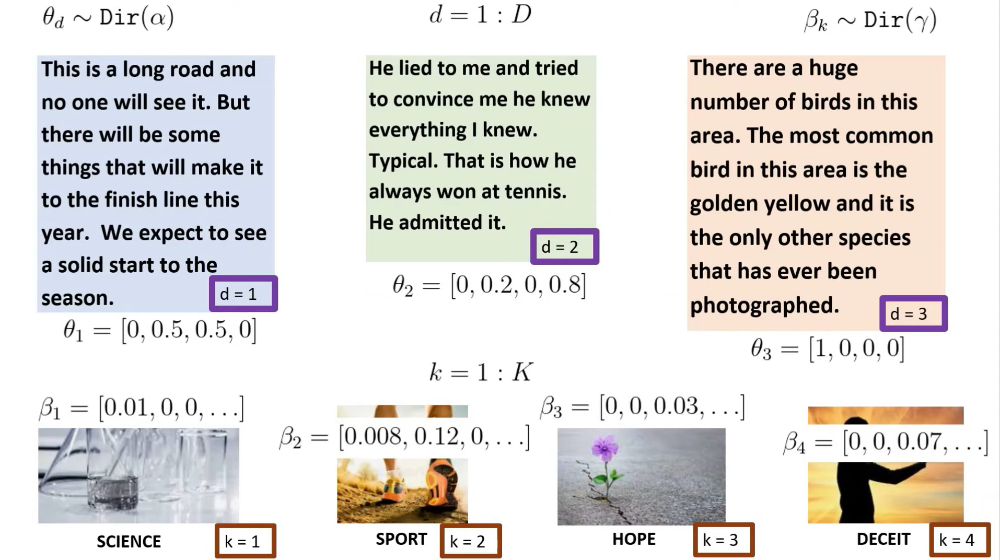

---
title: "Topic Modeling"
output:
  xaringan::moon_reader:
    lib_dir: libs
    nature:
      highlightStyle: github
      highlightLines: true
      countIncrementalSlides: false
      
   

---
class: inverse, middle, center

```{r setup, include=FALSE}
options(htmltools.dir.version = FALSE)
knitr::opts_chunk$set(message = FALSE, warning = FALSE, echo = TRUE)
```

---

[Example](assignment16_codes2.html)


---
# Topic Modeling

- Given a dataset containing many documents and each document is a text dataset

- Topic Modeling is to identify the topics for each document. 

- A document may have more than one topic.  

---
# Example 



---
# Latent Dirichlet Allocation (LDA)

- LDA is a family of statistical models that can generate text data

- The two parameters of LDA are vectors $\beta$ and $\gamma$

- The method assumes that the given text data is a sample/realization of a LDA model

- Searching for the parameters that maximizes the likelihood of having the text dataset will identify the topcs for each documents.

---
# LDA Assumptions 1

- a topic is a a distribution over words 

- A topic is identified by a collection of words where each word $w_i$ is associated with a probability $\beta_i$.  

- The sum of all these probabilities is 1

---
# LDA Assumptions 2

- A document is a mixture of topics 

- A document is identified by collection of topics where each topic $t_i$ is associated with a probability, $\gamma_i$. 

- The sum of all of these probabilities is 1

---



---


---



---
# Example 


```{r}
library(tidyverse)
library(tidytext)
library(tm)
library(wordcloud)
library(knitr)
df <- read_csv("topic_model.csv")

df = df %>% head(2)
```

---

```{r}

# create the DTM
df_tm <- df %>% 
  unnest_tokens(output = word, input = texts) %>% 
  anti_join(get_stopwords()) %>% 
  anti_join(tibble(word = c(letters, LETTERS, "oh", 'just', 've', as.character(c(1:100)))))

word_freq <- df_tm %>% 
  group_by(document) %>% count(word, sort = TRUE)

df_dtm <- word_freq %>% 
  cast_dtm(document = document, term = word, n)

library(topicmodels)
# Perform Topic Modeling

n_topics = 2
lda_out <-
  LDA(df_dtm, k = n_topics, method = 'Gibbs', control = list(seed = 1111))

lda_topics <- lda_out %>%
  tidy(matrix = "beta") 

```

---

- List of all words in topic 1 associated with their probabilities

```{r}
lda_topics %>% 
  filter(topic==1)
```


---

- List of all words in topic 2 associated with their probabilities

```{r}
lda_topics %>% 
  filter(topic==2)
```

---

- List of all topics in the document associated with their probability

```{r}
lda_out %>%
  tidy(matrix = "gamma") 
```


---

Sources

- https://personal.utdallas.edu/~nrr150130/cs6347/2015sp/lects/Lecture_17_LDA.pdf

- https://www.youtube.com/watch?v=1_jq_gWFUuQ


