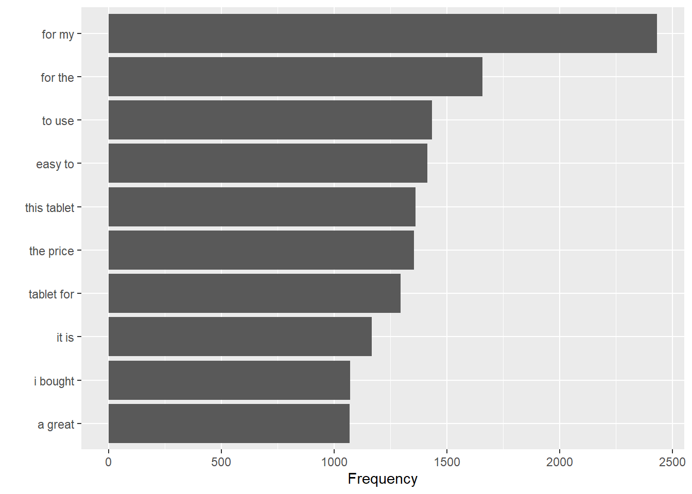
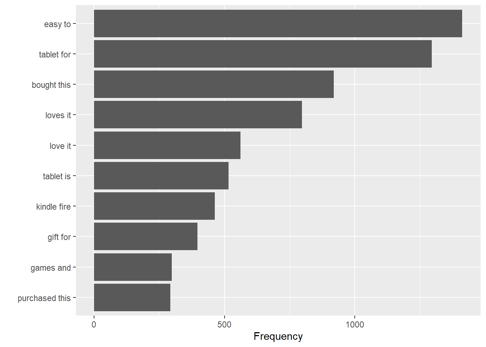
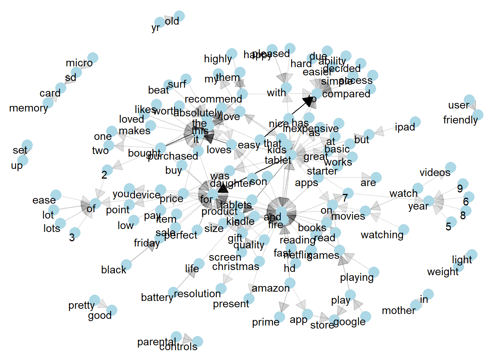
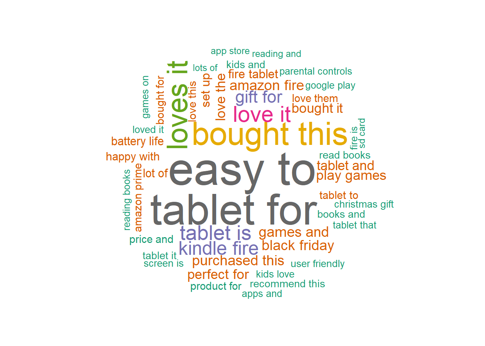
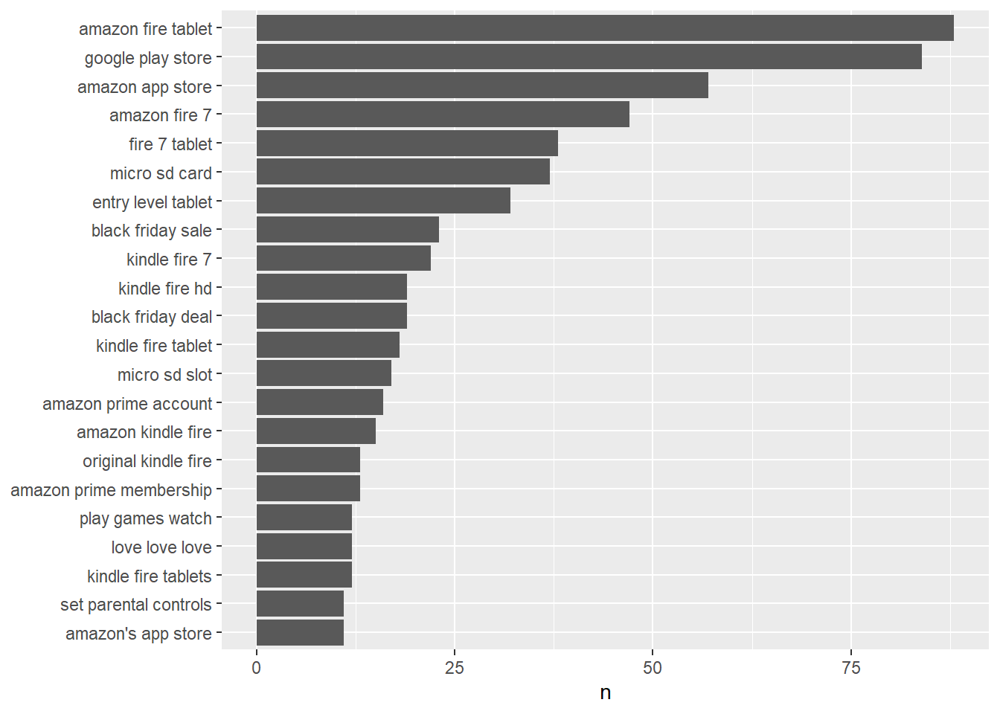
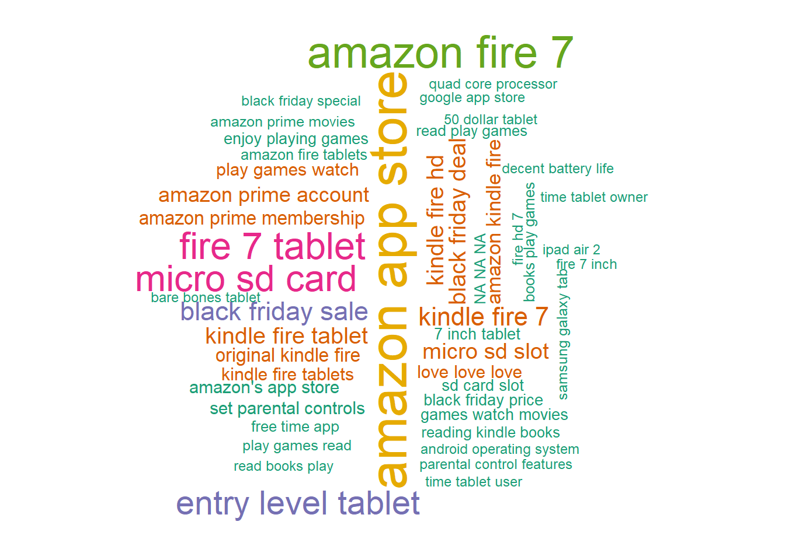
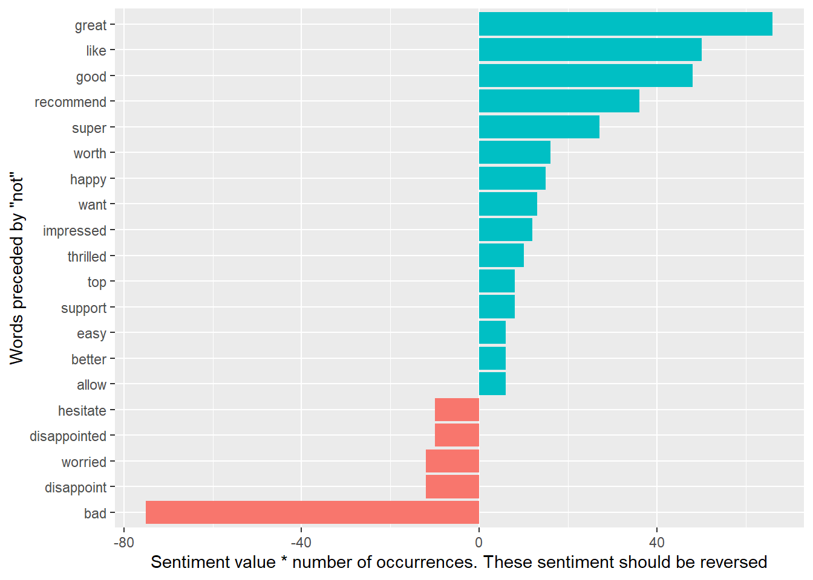
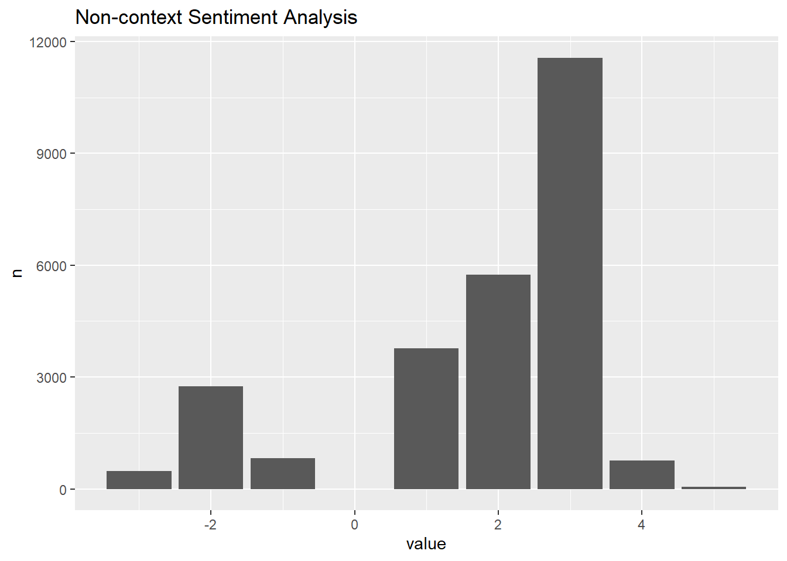
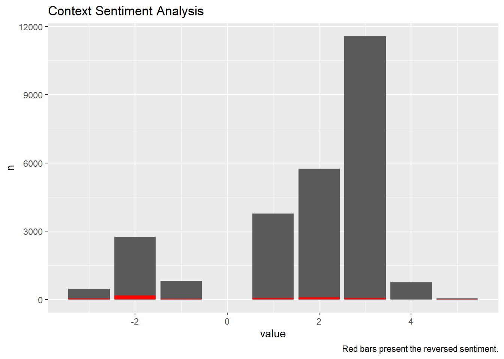

------------------------------------------------------------------------


## Datasets

[Dataset](amazon_reviews.csv)

- In this notebook, we will use the pairs of adjacent words to analyze a text dataset.  The dataset contains reviews from Amazon. 

- We only study the reviews for the item with most number of reviews. First, import the dataset and find out the item with the most number of reviews. 


::: {.cell}

```{.r .cell-code}
library(tidyverse)
library(ggplot2)
library(tidytext)
df <- read_csv('amazon_reviews.csv')

df %>% 
  group_by(name) %>% 
  count(sort = TRUE)
```

::: {.cell-output .cell-output-stdout}
```
# A tibble: 49 × 2
# Groups:   name [49]
   name                                                                        n
   <chr>                                                                   <int>
 1 "Fire Tablet, 7 Display, Wi-Fi, 8 GB - Includes Special Offers, Magent… 10966
 2  <NA>                                                                    6760
 3 "Echo (White),,,\r\nEcho (White),,,"                                     3309
 4 "Amazon Kindle Paperwhite - eBook reader - 4 GB - 6 monochrome Paperwh…  3176
 5 "All-New Fire HD 8 Tablet, 8 HD Display, Wi-Fi, 16 GB - Includes Speci…  2814
 6 "Amazon Fire Tv,,,\r\nAmazon Fire Tv,,,"                                 2527
 7 "Fire Kids Edition Tablet, 7 Display, Wi-Fi, 16 GB, Green Kid-Proof Ca…  1685
 8 "Brand New Amazon Kindle Fire 16gb 7 Ips Display Tablet Wifi 16 Gb Blu…  1038
 9 "Kindle Voyage E-reader, 6 High-Resolution Display (300 ppi) with Adap…   580
10 "Fire Tablet, 7 Display, Wi-Fi, 8 GB - Includes Special Offers, Black"    372
# ℹ 39 more rows
```
:::
:::


We then filter the dataset so that it contains only this item. 


::: {.cell}

```{.r .cell-code}
df = df %>% 
  select(name, reviews.text) %>% 
  filter(name=='Fire Tablet, 7 Display, Wi-Fi, 8 GB - Includes Special Offers, Magenta') %>% 
  rename(texts = reviews.text)
```
:::


## Create a list of pairs of words


::: {.cell}

```{.r .cell-code}
df_bigrams <- df %>%
  unnest_tokens(input = texts, output = bigram, token = "ngrams", n = 2) %>% 
  filter(!is.na(bigram))

df_bigrams %>%
  count(bigram, sort = TRUE)
```

::: {.cell-output .cell-output-stdout}
```
# A tibble: 75,462 × 2
   bigram          n
   <chr>       <int>
 1 for my       2431
 2 for the      1659
 3 to use       1434
 4 easy to      1413
 5 this tablet  1360
 6 the price    1355
 7 tablet for   1296
 8 it is        1166
 9 i bought     1072
10 a great      1068
# ℹ 75,452 more rows
```
:::
:::


- Top Most Frequent Paris


::: {.cell}

```{.r .cell-code}
df_bigrams %>%
  count(bigram, sort = TRUE) %>% 
  head(10) %>% 
  ggplot(aes(x = n, y = reorder(bigram, n))) +
  geom_col() +
  labs(y = '', x = 'Frequency')
```

::: {.cell-output-display}
{width=672}
:::
:::


## Remove the stop words

- Notice that there are many stopwords (for, to, a, an, the and so on) are in the pair of words. We will remove these words so that the pairs do not contain stopwords. 


::: {.cell}

```{.r .cell-code}
stop_words2 = tibble(word = c(letters, LETTERS, "oh", 'just', "XXXXX", "XXXX", "XX", "xxxx", "xxxxx", "xx"))

bigrams_separated <- df_bigrams %>%
    separate(bigram, c("word1", "word2"), sep = " ")

bigrams_filtered <- bigrams_separated %>%
    filter(!word1 %in% stop_words$word) %>%
    filter(!word1 %in% stop_words$word) %>%
    filter(!word1 %in% stop_words2$word) %>%
    filter(!word2 %in% stop_words2$word)

# new bigram counts:
bigram_counts <- bigrams_filtered %>% 
    count(word1, word2, sort = TRUE)
bigram_counts
```

::: {.cell-output .cell-output-stdout}
```
# A tibble: 37,691 × 3
   word1     word2     n
   <chr>     <chr> <int>
 1 easy      to     1413
 2 tablet    for    1296
 3 bought    this    920
 4 loves     it      798
 5 love      it      562
 6 tablet    is      516
 7 kindle    fire    463
 8 gift      for     396
 9 games     and     298
10 purchased this    292
# ℹ 37,681 more rows
```
:::
:::


- Top Most Frequent Pairs


::: {.cell}

```{.r .cell-code}
bigram_counts$pairs = paste0(bigram_counts$word1, " ", bigram_counts$word2)

bigram_counts %>% 
  head(10) %>% 
  ggplot(aes(x = n, y = reorder(pairs, n))) +
  geom_col() +
  labs(y = '', x = 'Frequency')
```

::: {.cell-output-display}
{width=672}
:::
:::


## Visualize the bigrams


::: {.cell}

```{.r .cell-code}
library(igraph)
bigram_graph <- bigram_counts %>%
  filter(n > 50) %>%
  graph_from_data_frame()

library(ggraph)
set.seed(2024)

a <- grid::arrow(type = "closed", length = unit(.15, "inches"))

ggraph(bigram_graph, layout = "fr") +
  geom_edge_link(aes(edge_alpha = n), show.legend = FALSE,
                 arrow = a, end_cap = circle(.07, 'inches')) +
  geom_node_point(color = "lightblue", size = 5) +
  geom_node_text(aes(label = name), vjust = 1, hjust = 1) +
  theme_void()
```

::: {.cell-output-display}
{width=672}
:::
:::

::: {.cell}

```{.r .cell-code}
## create a wordcloud
library(wordcloud) 
bigram_counts %>% 
  with(wordcloud(pairs, n, random.order = FALSE, 
                 max.words = 50, colors=brewer.pal(8,"Dark2")))
```

::: {.cell-output-display}
{width=672}
:::
:::


## 3-grams


::: {.cell}

```{.r .cell-code}
df_trigrams <- df %>%
  unnest_tokens(input = texts, output = trigram, token = "ngrams", n = 3) %>% 
  filter(!is.na(word))

df_separated <- df_trigrams %>%
    separate(trigram, c("word1", "word2", "word3"), sep = " ")

df_filtered <- df_separated %>%
    filter(!word1 %in% stop_words$word) %>%
    filter(!word2 %in% stop_words$word) %>% 
    filter(!word3 %in% stop_words$word)

trigram_count <- df_filtered %>% 
  count(word1, word2, word3, sort = TRUE) %>% 
  unite(word, word1, word2, word3, sep = " ")

## plot the frequency
trigram_count %>% 
  filter(n > 10) %>% 
  mutate(word = reorder(word, n)) %>% 
  ggplot(aes(word, n)) + 
  geom_col() + 
  xlab(NULL) + 
  coord_flip()
```

::: {.cell-output-display}
{width=672}
:::

```{.r .cell-code}
trigram_count %>% 
  with(wordcloud(word, n, random.order = FALSE, 
                 max.words = 50, colors=brewer.pal(8,"Dark2")))
```

::: {.cell-output-display}
{width=672}
:::
:::


## Context Sentiment Analysis

### Words preceded by NOT


::: {.cell}

```{.r .cell-code}
bigrams_separated %>%
  filter(word1 == "not") %>%
  count(word1, word2, sort = TRUE)
```

::: {.cell-output .cell-output-stdout}
```
# A tibble: 398 × 3
   word1 word2     n
   <chr> <chr> <int>
 1 not   a       129
 2 not   the      91
 3 not   as       90
 4 not   have     72
 5 not   be       45
 6 not   too      41
 7 not   very     39
 8 not   an       37
 9 not   so       36
10 not   to       35
# ℹ 388 more rows
```
:::

```{.r .cell-code}
AFINN <- get_sentiments("afinn")

not_words <- bigrams_separated %>%
  filter(word1 == "not") %>%
  inner_join(AFINN, by = c(word2 = "word")) %>%
  count(word2, value, sort = TRUE)

not_words
```

::: {.cell-output .cell-output-stdout}
```
# A tibble: 80 × 3
   word2      value     n
   <chr>      <dbl> <int>
 1 bad           -3    25
 2 like           2    25
 3 great          3    22
 4 recommend      2    18
 5 good           3    16
 6 want           1    13
 7 super          3     9
 8 worth          2     8
 9 allow          1     6
10 disappoint    -2     6
# ℹ 70 more rows
```
:::

```{.r .cell-code}
library(ggplot2)

not_words %>%
  mutate(contribution = n * value) %>%
  arrange(desc(abs(contribution))) %>%
  head(20) %>%
  mutate(word2 = reorder(word2, contribution)) %>%
  ggplot(aes(n * value, word2, fill = n * value > 0)) +
  geom_col(show.legend = FALSE) +
  labs(x = "Sentiment value * number of occurrences. These sentiment should be reversed",
       y = "Words preceded by \"not\"")
```

::: {.cell-output-display}
{width=672}
:::
:::


- There are issues with the sentiment analysis approach that only counts the appearance of positive or negative words. One of the issues is that a word’s the sentiment may be reverse with word such as `NOT`. 

- For example, the words sentence `I am not happy` does not have a positive sentiment, but the word `happy` will indicate a positive sentiment. 

- We will address this issue using the pairs of words. We will first identify all the words that connect with `not`, `no`, `never`, `without` then reverse the sentiment values of the these words.


::: {.cell}

```{.r .cell-code}
stop_word2 = tibble(word = c(letters, LETTERS, "oh", 'just'))
AFINN <- get_sentiments("afinn")

sentiment1 = df %>%
  unnest_tokens(input = texts, output = word) %>% 
  anti_join(get_stopwords()) %>% 
  anti_join(stop_word2) %>% 
  inner_join(get_sentiments("afinn")) %>% 
  filter(!is.na(value)) %>% 
  count(value)

sentiment1 %>% 
  ggplot(aes(x = value, y = n))+
  geom_col()+  
  labs(title = 'Non-context Sentiment Analysis')
```

::: {.cell-output-display}
{width=672}
:::

```{.r .cell-code}
negation_words <- c("not", "no", "never", "without")

sentiment2 = bigrams_separated %>%
  filter(word1 %in% negation_words) %>%
  inner_join(AFINN, by = c(word2 = "word")) %>%
  count(word1, word2, value, sort = TRUE) %>% 
  select(value, n) %>% 
  group_by(value) %>% 
  summarise(n = sum(n)) %>% 
  arrange(value)


ggplot()+
  geom_col(data = sentiment1, aes(x =value, y = n))+
  geom_col(data = sentiment2, aes(x =value, y = n), fill = 'red')+
  labs(title = 'Context Sentiment Analysis',
       caption = "Red bars present the reversed sentiment.")
```

::: {.cell-output-display}
{width=672}
:::
:::

