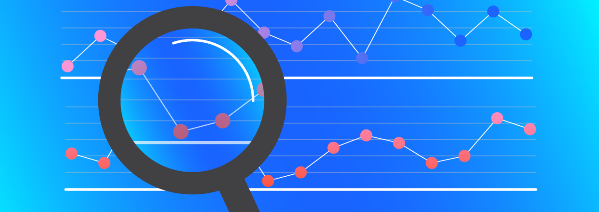

------------------------------------------------------------------------

### Instruction

*Put the codes in an Rmarkdown file and knit it to Word Document. Submit the Word document to Canvas.*

------------------------------------------------------------------------

### Question 1.

Working with the [inflation data](inflation.csv). The dataset contains monthly observations in the US from 1950-2 to 1990-12.  A time series containing :

- pai1: one-month inflation rate (in percent, annual rate)

- pai3: three-month inflation rate (in percent, annual rate)

- tb1: one-month T-bill rate (in percent, annual rate)

- tb3: three-month T-bill rate (in percent, annual rate)

- cpi: CPI for urban consumers, all items (the 1982-1984 average is set to 100)

**Do the follows.**

-   Create a time series of three-month inflation rate

-   Plot the series and the ACF to check if the series is stationary

-   Create the differenced series and check for stationary

-   Fit the MA(1) model to the series and plot the fitted series

-   Make prediction on the next value of three-month inflation rate

-   Fit the AR(1) model to the series and plot the fitted series

-   Make prediction on the next value of three-month inflation rate

### Question 2.

Consider the [Consumption data](consumption.csv). This is a quarterly data on consumption and expenditure in Canada. The series started from Quarter 1 in 1947.

The time series containing :

-   yd: personal disposable income, 1986 dollars

-   ce: personal consumption expenditure, 1986 dollars

Let $y_t$ be the personal consumption expenditure series. Assume that the differenced series of $y_t$ is stationary.

-   Use the MA(1) model to fit the differenced series and make a prediction on the next value of $y_t$ .

-   Plot the fitted $y_t$ and $y_t$ on the same graph.

