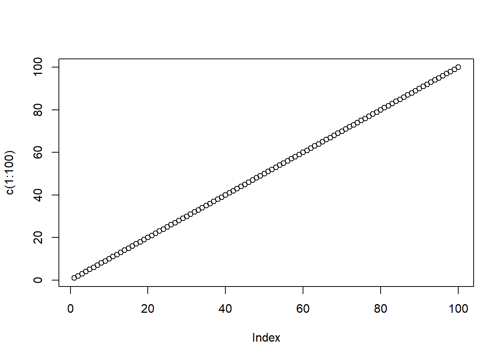

## 1. My first Quarto Document

Quarto enables you to weave together content and executable code into a finished document. To learn more about Quarto see <https://quarto.org>.

### 1.1 Running Code

When you click the **Render** button a document will be generated that includes both content and the output of embedded code. You can embed code like this:


::: {.cell}

```{.r .cell-code}
1 + 1
```

::: {.cell-output .cell-output-stdout}
```
[1] 2
```
:::
:::


You can add options to executable code like this


::: {.cell}
::: {.cell-output .cell-output-stdout}
```
[1] 4
```
:::
:::


The `echo: false` option disables the printing of code (only output is displayed).

### 1.2 Running Code

[My Link](https://www.google.com/)

My table

| Syntax | Description |
| ----------- | ----------- |
| Header | Title |
| Paragraph | Text |


::: {.cell}

```{.r .cell-code}
plot(c(1:100))
```

::: {.cell-output-display}
{width=672}
:::
:::


## R Markdown

This is an R Markdown document. Markdown is a simple formatting syntax for authoring HTML, PDF, and MS Word documents. For more details on using R Markdown see <http://rmarkdown.rstudio.com>.

When you click the **Knit** button a document will be generated that includes both content as well as the output of any embedded R code chunks within the document. You can embed an R code chunk like this:


::: {.cell}

```{.r .cell-code}
summary(cars)
```

::: {.cell-output .cell-output-stdout}
```
     speed           dist       
 Min.   : 4.0   Min.   :  2.00  
 1st Qu.:12.0   1st Qu.: 26.00  
 Median :15.0   Median : 36.00  
 Mean   :15.4   Mean   : 42.98  
 3rd Qu.:19.0   3rd Qu.: 56.00  
 Max.   :25.0   Max.   :120.00  
```
:::
:::


## Including Plots

You can also embed plots, for example:


::: {.cell}
::: {.cell-output-display}
{width=672}
:::
:::


Note that the `echo = FALSE` parameter was added to the code chunk to prevent printing of the R code that generated the plot.

