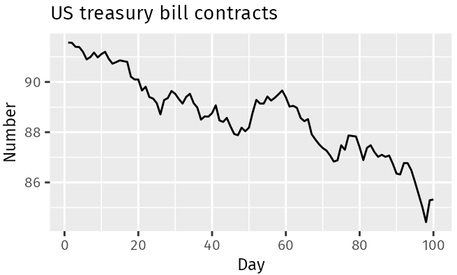
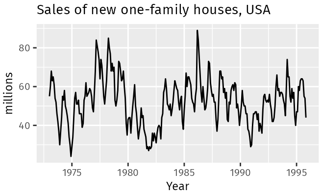
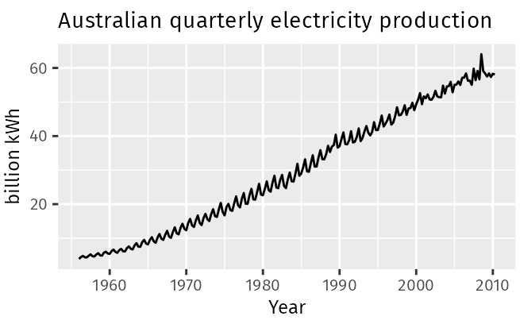
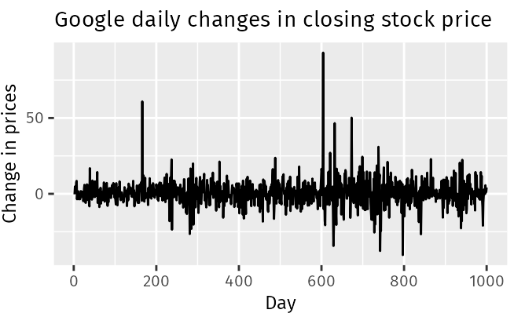

# Time Series Patterns

A time series may consist of 

- trend, 

- seasonality and 

- cycles

# Trend

- A trend is a long-term increase or decrease in the data. 

- Trend does not have to be linear. 

- Sometimes we will refer to a trend as “changing direction”, when it might go from an increasing trend to a decreasing trend. 

# Examples

- The US treasury bill contracts show results from the Chicago market for 100 consecutive trading days in 1981. There is a downward trend

# Examples

- There is no apparent trend in the data over this period

# Cycle and Seasonal

- cycle: repeated events over time that are not equally spaced

- seasonal: repeated events over time that are equally spaced

# Examples

- The monthly housing sales show strong seasonality within each year, as well as some strong cyclic behaviour with a period of about 6–10 years

# Examples

The Australian quarterly electricity production shows a strong increasing trend, with strong seasonality. There is no evidence of any cyclic behavior here

# 

- No trend, seasonality or cyclic behaviour. There are random fluctuations which do not appear to be very predictable, and no strong patterns that would help with developing a forecasting model.

# Time series decomposition

- When we decompose a time series into components, we usually combine the trend and cycle into a single trend-cycle component (sometimes called the trend for simplicity). 

- Three components: a trend-cycle component, a seasonal component, and a remainder component (containing anything else in the time series).

# Two decompositions

- Additive Decomposition

$$
y_t = S_t + T_t + R_t
$$

- Multiplicative decomposition

$$
y_t = S_t\times T_t \times R_t
$$

# Relationship

- The log transformation will turn a multiplicative model to additive model. 

# Central MA vs. MA

[Link](https://tjeld.uia.no/shiny/valeriz/centered-vs-right/#:~:text=The%20turning%20point%20in%20a,the%20greater%20the%20lag%20time).

# Classical Decomposition

- Trend Estimate: Smooth the data using centred moving average (CMA) of the order equal to the periodicity of the data

- Detrend the data:  calculate the detrended series by subtracting/dividing the trend estimate 

- Seasonal Estimate: Average value for each period is calculated based on the de-trended series. 

- Random/Remainder: subtract from the series the trend and seasonal component estimations

#

::: {.cell}
::: {.cell-output-display}

:::
:::

#

::: {.cell}
::: {.cell-output-display}

:::
:::

#

::: {.cell}
::: {.cell-output-display}

:::
:::

#

::: {.cell}
::: {.cell-output-display}

:::
:::

#

::: {.cell}
::: {.cell-output-display}

:::
:::

