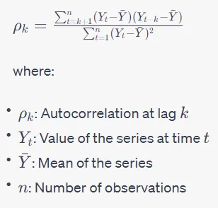

---
title: "White Noise and Random Walk"
author: <font size="5"> Son Nguyen </font>
output:
  xaringan::moon_reader:
    css: [default, metropolis, metropolis-fonts]
    lib_dir: libs
    nature:
      highlightStyle: github
      highlightLines: true
      countIncrementalSlides: false
      slideNumberFormat: |
        <div class="progress-bar-container">
          <div class="progress-bar" style="width: calc(%current% / %total% * 100%);">
          </div>
        </div>`
---

<style>

.remark-slide-content {
  background-color: #FFFFFF;
  border-top: 80px solid #F9C389;
  font-size: 17px;
  font-weight: 300;
  line-height: 1.5;
  padding: 1em 2em 1em 2em
}

.inverse {
  background-color: #696767;
  border-top: 80px solid #696767;
  text-shadow: none;
  background-image: url(https://github.com/goodekat/presentations/blob/master/2019-isugg-gganimate-spooky/figures/spider.png?raw=true);
	background-position: 50% 75%;
  background-size: 150px;
}

.your-turn{
  background-color: #8C7E95;
  border-top: 80px solid #F9C389;
  text-shadow: none;
  background-image: url(https://github.com/goodekat/presentations/blob/master/2019-isugg-gganimate-spooky/figures/spider.png?raw=true);
	background-position: 95% 90%;
  background-size: 75px;
}

.title-slide {
  background-color: #F9C389;
  border-top: 80px solid #F9C389;
  background-image: none;
}

.title-slide > h1  {
  color: #111111;
  font-size: 40px;
  text-shadow: none;
  font-weight: 400;
  text-align: left;
  margin-left: 15px;
  padding-top: 80px;
}
.title-slide > h2  {
  margin-top: -25px;
  padding-bottom: -20px;
  color: #111111;
  text-shadow: none;
  font-weight: 300;
  font-size: 35px;
  text-align: left;
  margin-left: 15px;
}
.title-slide > h3  {
  color: #111111;
  text-shadow: none;
  font-weight: 300;
  font-size: 25px;
  text-align: left;
  margin-left: 15px;
  margin-bottom: -30px;
}

</style>

```{css, echo=FALSE}
.left-code {
  color: #777;
  width: 48%;
  height: 92%;
  float: left;
}
.right-plot {
  width: 51%;
  float: right;
  padding-left: 1%;
}
```

```{r setup, include = FALSE}

# R markdown options
knitr::opts_chunk$set(echo = TRUE, 
                      
                      fig.width = 10,
                      fig.height = 5,
                      fig.align = "center", 
                      message = FALSE,
                      warning = FALSE)

# Load packages
library(tidyverse)
```

---
# White Noise

-   $y_t$ is a white-noise process (series) if $y_1$, $y_2$,..., $y_t$ are independent identical distributed (iid) zero mean random variables from a certain distribution (usually normal)

---
# Example

```{r}
set.seed(30)
y <- ts(rnorm(100))
library(ggfortify)
autoplot(y) + ggtitle("White noise of Standard Normal Distribution")
```
---
# Example

```{r}
set.seed(30)

y = sample(c(-1, 1), 100, replace = TRUE)

y <- ts(y)
library(ggfortify)
autoplot(y) + ggtitle("White noise of Tossing a Coin")
```
---
# Correlogram

- Autocorrelation lag with lag k is the the correlation between the time series $y_t$ and $y_{t-k}$



- Autocorrelation lag with lag 0 is always 1

- The Correlogram is the plot of the autocorrelations for values of lag k = 0, 1, 2,...

---
# Correlogram a white noise

- Correlogram of a white noise

```{r}
# create a white-noise time series
y = ts(rnorm(100))

# plot its ACF or correlogram 
acf(y)
```

---
# Correlogram a white noise

```{r}
set.seed(30)
y = sample(c(-1, 1), 100, replace = TRUE)

y <- ts(y)

acf(y)

```

---
# Correlogram a time series with trend

- Usually a trend in the data will show in the correlogram as a slow decay in the autocorrelation

```{r}
y = ts(c(1:100))
acf(y)
```

---
# The Correlogram - Example

```{r}
y = ts(cos(c(1:100))+rnorm(100))
acf(y)
```

---
# ACF of a time series with seasonality

```{r}
set.seed(30)
y = cos(1:100)
y <- ts(y)
acf(y)
```

---
# Random Walk

-   A time series $y_t$ is called a random walk if

    $$y_{t} =  y_{t-1} +  \epsilon_t,$$

    where $\epsilon_t$ is a white-noise

-   A random walk can be written as

$$
y_t = y_0 + \epsilon_1 + \epsilon_2 +...+\epsilon_t
$$

---
# Example

```{r}
set.seed(1)
n <- 5
ct = sample(c(-1, 1), n, TRUE)
x <- cumsum(c(0,ct))
plot(ts(x))
```

---
# Example

```{r}
set.seed(1)
n <- 1000
ct = c(0, sample(c(-1, 1), n, TRUE))
x <- cumsum(ct)
plot(ts(x))
```

---
# Example

```{r}
set.seed(3000)
n = 100
c <- rnorm(n)
y_0 = 0
y = c(y_0, 2:n)
for (i in 2:n)
{
  y[i] = y[i-1]+c[i]
}
y = ts(y)
plot(y) 
```

---
# Random Walk with drift

-   A time series $y_t$ is called a random walk if

    $$y_{t} =  y_{t-1} +  d + \epsilon_t,$$

    where $\epsilon_t$ is a white-noise

-   A random walk can be written as

$$
y_t = y_0 + dt + \epsilon_1 + \epsilon_2 +...+\epsilon_t
$$

---
# Example

.left-code[
```{r step1281110, eval = FALSE, echo = TRUE}
set.seed(30)
n = 1000
c <- rnorm(n, sd = 20)
y_0 = 0
drift = 5

y = c(y_0, 2:n)

for (i in 2:n)
{
  y[i] = drift  + y[i-1]+c[i]
}

library(ggfortify)
library(latex2exp)

plot(ts(y)) 
title(paste0("A random walk with drift ", drift))
```
]
.right-plot[
```{r, ref.label = "step1281110", echo = FALSE, cache = TRUE, fig.height = 6, fig.width = 7}
```
]

---
# The ACF of Random Walks

```{r}
n = 100
error_mean = 0
c <- rnorm(n, mean = error_mean, sd = 30)
y_0 = 0
y = c(y_0, 2:n)

for (i in 2:n)
{
  y[i] = y[i-1]+c[i]
}

acf(y)
```

---
# Differencing Time Series


.left-code[
```{r s1, eval = FALSE, echo = TRUE}
n = 100
error_mean = 0
drift = 100
c <- rnorm(n, mean = error_mean, sd = 30)
y_0 = 0
y = c(y_0, 2:n)

for (i in 2:n)
{
  y[i] = drift+ y[i-1]+c[i]
}

y = ts(y)

plot(y)
```
]
.right-plot[
```{r, ref.label = "s1", echo = FALSE, cache = TRUE, fig.height = 6, fig.width = 7}
```
]


---

```{r}
plot(diff(y))
```

---

```{r}
acf(y)
```

---

```{r}
acf(diff(y))
```

---
# Random Walks and Stocks

```{r}
library(quantmod)
getSymbols('MSFT', src='yahoo')
y = Ad(MSFT[index(MSFT)>"2023-01-01",])

plot(y)
plot(diff(y))
```

---

```{r}
acf(diff(y), na.action = na.pass)
```

---

- The differencing series could be a white noise

- It is very reasonable to assume that the stock follows the random walk model. 


<!---
---
#

```{r}
n = 100
error_mean = 0
drift = 40
c <- rnorm(n, mean = error_mean, sd = 30)
y_0 = 0
y = c(y_0, 2:n)

for (i in 2:n)
{
  y[i] = drift+ y[i-1]+c[i]
}

y = ts(y)

```

---
# Estimate the random walk model

For a given time series y we can fit the random walk model with a drift by 

- first differencing the data, 

- then fitting the white noise (WN) model to the differenced data using the arima() command with the order = c(0, 0, 0)) argument.

- The arima() command displays information or output about the fitted model. Under the Coefficients: heading is the estimated drift variable, named the intercept. Its approximate standard error (or s.e.) is provided directly below it. The variance of the WN part of the model is also estimated under the label sigma^2.

---
#

```{r}
library(quantmod)
getSymbols('MSFT', src='yahoo')
y = Ad(MSFT[index(MSFT)>"2023-01-01",])

dy = diff(y)

arima(dy, order = c(0,0,0))
```


---
# Forecasting with Random Walks

Suppose that we know $y_0, y_1, ..., y_T$ and we want to forecast $y_{T+l}$ for some fixed $l>0$

-   Point forecast: the estimated $l$ step-ahead is

$$
\hat{y}_{T+l} = y_T + l\hat{\mu}_{c},
$$ where $\hat{\mu}_{c}$ is the estimated mean of the white-noise. $\hat{\mu}_{c}$ can be $\bar{c}$

$$\bar{c} = \frac{\epsilon_1 + \epsilon_2 + ...+\epsilon_T}{T}$$

-   The standard error of the forecast is $s_c\sqrt{l}$, where $s_c$ is the estimated standard deviation of $\sigma_c$,

$$
s^2_c = \frac{1}{n-1}\sum_{i=1}^{T} \big(\epsilon_i - \bar{c}\big)^2
$$

# 

---
### Example

You are given:

i)  The random walk model

$$
y_t =  y_0 + \epsilon_1 + \epsilon_2 + \epsilon_3 +...+\epsilon_t,
$$

where $\epsilon_i, (i = 1, 2,..., t)$ denote observations from a white noise process.

ii) The following ten observed values of $\epsilon_t$:

| t     | 1   | 2   | 3   | 4   | 5   | 6   | 7   | 8   | 9   | 10  |
|:------|:----|:----|:----|:----|:----|:----|:----|:----|:----|:----|
| $y_t$ | 2   | 5   | 10  | 13  | 18  | 20  | 24  | 25  | 27  | 30  |

iii) $y_0 = 0$

Calculate the 9 step-ahead forecast, $\hat{y}_{19}$.

# 

# 

---
### Example

You are given:

i)  The random walk model

$$
y_t =  y_0 + \epsilon_1 + \epsilon_2 + \epsilon_3 +...+\epsilon_t,
$$

where $\epsilon_i, (i = 1, 2,..., t)$ denote observations from a white noise process.

ii) The following ten observed values of $\epsilon_t$:

| t     | 1   | 2   | 3   | 4   | 5   | 6   | 7   | 8   | 9   | 10  |
|:------|:----|:----|:----|:----|:----|:----|:----|:----|:----|:----|
| $y_t$ | 2   | 5   | 10  | 13  | 18  | 20  | 24  | 25  | 27  | 30  |

iii) $y_0 = 0$

Calculate the standard error of the 9 step-ahead forecast, $\hat{y}_{19}$.

# 

We have $\epsilon_t = y_t -y_{t-1} \implies \epsilon_1, \epsilon_2, ..., \epsilon_{10} = 2,3,5,3,5, 2, 4,1, 2,3$

$$ \implies \bar{c} = \frac{\epsilon_1 + \epsilon_2 + ...+\epsilon_{10}}{10} = 3$$

$$
\implies s^2_c = \frac{1}{9}\sum_{i=1}^{10} \big(\epsilon_i - 3\big)^2 = 16/9
$$ Hence, the standard error is $s_c\sqrt{l} = \frac{4}{3}\sqrt{9} = 4$


your comment goes here
and here
-->


