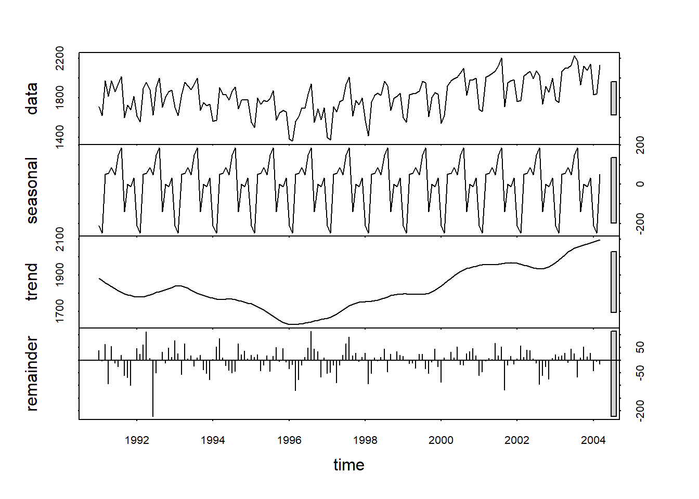

------------------------------------------------------------------------

This is sample codes for the time series project.  The codes work on the series of monthly Amtrak
ridership between January 1991 and March 2004 in the United States.  The dataset can be download at the link below. 

[Data](Amtrak_data.csv)

------------------------------------------------------------------------

## 1. Data Exploration

-   Import the series. Note: Make sure you specify the correct starting time and frequency for the series.

-   Plot the time series.


::: {.cell}

```{.r .cell-code}
library(TTR)
library(forecast)
df <- read.csv("Amtrak_data.csv")
y <- ts(df$Ridership, start = c(1991,1), end = c(2004, 3), freq = 12)
plot(y)
```

::: {.cell-output-display}
{width=672}
:::
:::


### 1.1 Smoothing

-   *Moving Average*


::: {.cell}

```{.r .cell-code}
plot(y)

# create a moving average series
k = 16  # set the moving average 
y_sma = SMA(y, n = k)

# plot the moving average series
lines(y_sma, col = "red")
```

::: {.cell-output-display}
{width=672}
:::
:::


-   *Exponential Smoothing* 


::: {.cell}

```{.r .cell-code}
plot(y)

# create a moving average series
w = .7

y_ema = EMA(y, ratio = 1-w)


# plot the moving average series
lines(y_ema, col = "red")
```

::: {.cell-output-display}
{width=672}
:::
:::


### 1.2 Decomposition

-   *Classical Decomposition*


::: {.cell}

```{.r .cell-code}
ourDecomposition <- decompose(y, type="additive")
plot(ourDecomposition)
```

::: {.cell-output-display}
{width=672}
:::
:::

::: {.cell}

```{.r .cell-code}
ourDecomposition <- decompose(y, type="multiplicative")
plot(ourDecomposition)
```

::: {.cell-output-display}
{width=672}
:::
:::


-   *STL Decomposition*


::: {.cell}

```{.r .cell-code}
ourDecomposition <- stl(y, s.window = "periodic")
plot(ourDecomposition)
```

::: {.cell-output-display}
{width=672}
:::
:::


### 1.3 Auto-correltion

-   ACF


::: {.cell}

```{.r .cell-code}
acf(y)
```

::: {.cell-output-display}
{width=672}
:::
:::


-   PACF


::: {.cell}

```{.r .cell-code}
pacf(y)
```

::: {.cell-output-display}
{width=672}
:::
:::


## 2. Modelling

### 2.1 Model Training

-   Split the original series into the training series and the testing series

-   Train all six models


::: {.cell}

```{.r .cell-code}
# data partition

# set the proportion of the test set 
p = .2 

nValid <- round(.2*length(y))
nTrain <- length(y) - nValid
train.ts <- window(y, start = c(1991, 1), end = c(1991, nTrain))
valid.ts <- window(y, start = c(1991, nTrain + 1))

# Modeling
# baseline models

# average method: forecast by the average of the training series
model1 = meanf(train.ts, h = nValid, level = 0)

# naive: forecast by the last observation of the series
model2 = naive(train.ts, h = nValid, level = 0)

# seasonal naive: forecast by the last season
model3 = snaive(train.ts, h = nValid, level = 0)

# drift: drawing the line from the first to the last observation
model4 = rwf(train.ts, h = nValid, level = 0, drift = TRUE)


# more advanced model
model5 = HoltWinters(train.ts, alpha=TRUE, 
                            beta=TRUE, 
                            gamma=TRUE)
model6 = auto.arima(train.ts)
```
:::


### 2.2 Residual Analysis

Report the residuals analysis of all the models.


::: {.cell}

```{.r .cell-code}
checkresiduals(model1)
```

::: {.cell-output-display}
{width=672}
:::

::: {.cell-output .cell-output-stdout}

```

	Ljung-Box test

data:  Residuals from Mean
Q* = 261.98, df = 24, p-value < 2.2e-16

Model df: 0.   Total lags used: 24
```


:::

```{.r .cell-code}
checkresiduals(model2)
```

::: {.cell-output-display}
{width=672}
:::

::: {.cell-output .cell-output-stdout}

```

	Ljung-Box test

data:  Residuals from Naive method
Q* = 385.37, df = 24, p-value < 2.2e-16

Model df: 0.   Total lags used: 24
```


:::

```{.r .cell-code}
checkresiduals(model3)
```

::: {.cell-output-display}
{width=672}
:::

::: {.cell-output .cell-output-stdout}

```

	Ljung-Box test

data:  Residuals from Seasonal naive method
Q* = 186.12, df = 24, p-value < 2.2e-16

Model df: 0.   Total lags used: 24
```


:::

```{.r .cell-code}
checkresiduals(model4)
```

::: {.cell-output-display}
{width=672}
:::

::: {.cell-output .cell-output-stdout}

```

	Ljung-Box test

data:  Residuals from Random walk with drift
Q* = 385.37, df = 24, p-value < 2.2e-16

Model df: 0.   Total lags used: 24
```


:::

```{.r .cell-code}
checkresiduals(model5)
```

::: {.cell-output-display}
{width=672}
:::

::: {.cell-output .cell-output-stdout}

```

	Ljung-Box test

data:  Residuals from HoltWinters
Q* = 185.42, df = 23, p-value < 2.2e-16

Model df: 0.   Total lags used: 23
```


:::

```{.r .cell-code}
checkresiduals(model6)
```

::: {.cell-output-display}
{width=672}
:::

::: {.cell-output .cell-output-stdout}

```

	Ljung-Box test

data:  Residuals from ARIMA(1,1,1)(0,1,1)[12]
Q* = 13.962, df = 21, p-value = 0.8712

Model df: 3.   Total lags used: 24
```


:::
:::


### 2.3 Testing Accuracy

-   Calculate the forecast of all the models on the validation period. Calculate the Mean absolute percentage error (MAPE) of all the models. Plot the forecast of all models. 


::: {.cell}

```{.r .cell-code}
# forecasting
forecast1 = forecast(model1, h = nValid, level = 0)
forecast2 = forecast(model2, h = nValid, level = 0)
forecast3 = forecast(model3, h = nValid, level = 0)
forecast4 = forecast(model4, h = nValid, level = 0)
forecast5 = forecast(model5, h = nValid, level = 0)
forecast6 = forecast(model6, h = nValid, level = 0)


# plotting forecast
plot(forecast1)
lines(valid.ts, col = 'red')
```

::: {.cell-output-display}
{width=672}
:::

```{.r .cell-code}
plot(forecast2)
lines(valid.ts, col = 'red')
```

::: {.cell-output-display}
{width=672}
:::

```{.r .cell-code}
plot(forecast3)
lines(valid.ts, col = 'red')
```

::: {.cell-output-display}
{width=672}
:::

```{.r .cell-code}
plot(forecast4)
lines(valid.ts, col = 'red')
```

::: {.cell-output-display}
{width=672}
:::

```{.r .cell-code}
plot(forecast5)
lines(valid.ts, col = 'red')
```

::: {.cell-output-display}
{width=672}
:::

```{.r .cell-code}
plot(forecast6)
lines(valid.ts, col = 'red')
```

::: {.cell-output-display}
{width=672}
:::

```{.r .cell-code}
# accuracy
a1 = accuracy(forecast1$mean, valid.ts)
a2 = accuracy(forecast2$mean, valid.ts)
a3 = accuracy(forecast3$mean, valid.ts)
a4 = accuracy(forecast4$mean, valid.ts)
a5 = accuracy(forecast5$mean, valid.ts)
a6 = accuracy(forecast6$mean, valid.ts)

rbind(a1, a2, a3,a4, a5, a6)
```

::: {.cell-output .cell-output-stdout}

```
                 ME       RMSE        MAE        MPE       MAPE      ACF1
Test set  202.46011  250.42190  214.27943   9.690132  10.372555 0.2158457
Test set -142.80638  205.21865  157.98381  -7.813004   8.503234 0.2158457
Test set   38.80109   90.35009   78.99916   1.893213   4.040323 0.6676804
Test set -197.51828  243.52113  203.12179 -10.555686  10.809635 0.1502553
Test set 4326.88943 4976.78343 4326.88943 216.780328 216.780328 0.9080528
Test set  -55.30053   82.71212   60.56744  -2.864758   3.129195 0.5172799
          Theil's U
Test set  1.3109970
Test set  1.1603260
Test set  0.4927380
Test set  1.3784127
Test set 27.5273625
Test set  0.4577504
```


:::
:::


## 3. Forecasting

Based on the model evaluation above, decide the best model. Retrain the best model on the entire series. Use the retrained model to forecast the next values. Plot the series and the forecast values.


::: {.cell}

```{.r .cell-code}
# the arima model gives the lowest MAPE, 
# so we will select this model as the final model 
# to train it on the entire dataset to make forecasting.

selected_model =  auto.arima(y)
new_forecast = forecast(selected_model)
plot(new_forecast)
```

::: {.cell-output-display}
{width=672}
:::
:::


------------------------------------------------------------------------
