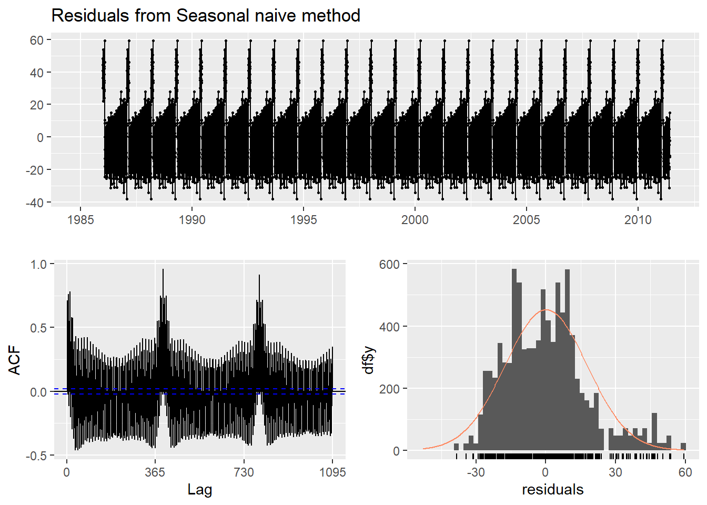
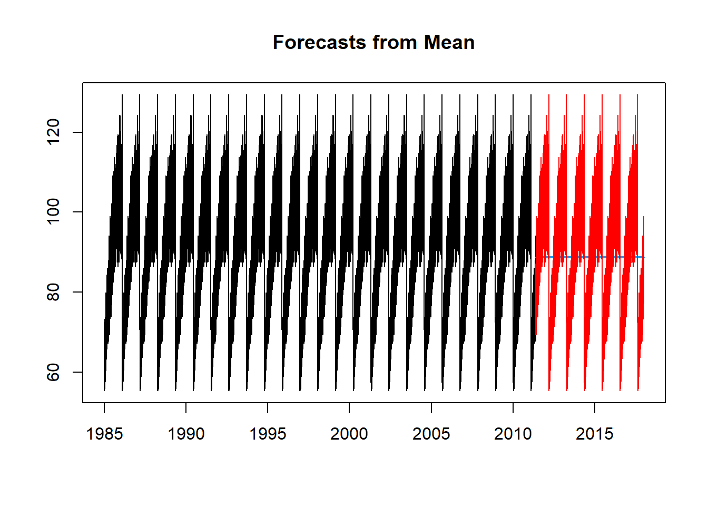

------------------------------------------------------------------------

This is sample codes for the time series project.  The dataset can be download at the link below. 

[Data](data/Electric_Production.csv)

------------------------------------------------------------------------

## 1. Data Exploration

-   Import the series. Note: Make sure you specify the correct starting time and frequency for the series.

-   Plot the time series.


::: {.cell}

```{.r .cell-code}
library(TTR)
library(forecast)
df <- read.csv("data/Electric_Production.csv")
y <- ts(df$IPG2211A2N, start = c(1985,1), end = c(2018, 1), freq = 365)
plot(y)
```

::: {.cell-output-display}
{width=672}
:::
:::


### 1.1 Smoothing

-   *Moving Average*


::: {.cell}

```{.r .cell-code}
plot(y)

# create a moving average series
k = 16  # set the moving average 
y_sma = SMA(y, n = k)

# plot the moving average series
lines(y_sma, col = "red")
```

::: {.cell-output-display}
{width=672}
:::
:::


-   *Exponential Smoothing* 


::: {.cell}

```{.r .cell-code}
plot(y)

# create a moving average series
w = .7

y_ema = EMA(y, ratio = 1-w)


# plot the moving average series
lines(y_ema, col = "red")
```

::: {.cell-output-display}
{width=672}
:::
:::


### 1.2 Decomposition

-   *Classical Decomposition*


::: {.cell}

```{.r .cell-code}
ourDecomposition <- decompose(y, type="additive")
plot(ourDecomposition)
```

::: {.cell-output-display}
{width=672}
:::
:::

::: {.cell}

```{.r .cell-code}
ourDecomposition <- decompose(y, type="multiplicative")
plot(ourDecomposition)
```

::: {.cell-output-display}
{width=672}
:::
:::


-   *STL Decomposition*


::: {.cell}

```{.r .cell-code}
ourDecomposition <- stl(y, s.window = "periodic")
plot(ourDecomposition)
```

::: {.cell-output-display}
{width=672}
:::
:::


### 1.3 Auto-correltion

-   ACF


::: {.cell}

```{.r .cell-code}
acf(y)
```

::: {.cell-output-display}
{width=672}
:::
:::


-   PACF


::: {.cell}

```{.r .cell-code}
pacf(y)
```

::: {.cell-output-display}
{width=672}
:::
:::


## 2. Modelling

### 2.1 Model Training

-   Split the original series into the training series and the testing series

-   Train all six models


::: {.cell}

```{.r .cell-code}
# data partition

# set the proportion of the test set 
p = .2 

nValid <- round(.2*length(y))
nTrain <- length(y) - nValid
train.ts <- window(y, start = c(1985, 1), end = c(1985, nTrain))
valid.ts <- window(y, start = c(1985, nTrain + 1), end = c(1985, nTrain + nValid))

# Modeling
# baseline models

# average method: forecast by the average of the training series
model1 = meanf(train.ts, h = nValid, level = 0)

# naive: forecast by the last observation of the series
model2 = naive(train.ts, h = nValid, level = 0)

# seasonal naive: forecast by the last season
model3 = snaive(train.ts, h = nValid, level = 0)

# drift: drawing the line from the first to the last observation
model4 = rwf(train.ts, h = nValid, level = 0, drift = TRUE)


# more advanced model
model5 = HoltWinters(train.ts, alpha=TRUE, 
                            beta=TRUE, 
                            gamma=TRUE)
model6 = auto.arima(train.ts)
```
:::


### 2.2 Residual Analysis

Report the residuals analysis of all the models.


::: {.cell}

```{.r .cell-code}
checkresiduals(model1)
```

::: {.cell-output-display}
{width=672}
:::

::: {.cell-output .cell-output-stdout}

```

	Ljung-Box test

data:  Residuals from Mean
Q* = 932711, df = 730, p-value < 2.2e-16

Model df: 0.   Total lags used: 730
```


:::

```{.r .cell-code}
checkresiduals(model2)
```

::: {.cell-output-display}
{width=672}
:::

::: {.cell-output .cell-output-stdout}

```

	Ljung-Box test

data:  Residuals from Naive method
Q* = 1248588, df = 730, p-value < 2.2e-16

Model df: 0.   Total lags used: 730
```


:::

```{.r .cell-code}
checkresiduals(model3)
```

::: {.cell-output-display}
{width=672}
:::

::: {.cell-output .cell-output-stdout}

```

	Ljung-Box test

data:  Residuals from Seasonal naive method
Q* = 534885, df = 730, p-value < 2.2e-16

Model df: 0.   Total lags used: 730
```


:::

```{.r .cell-code}
checkresiduals(model4)
```

::: {.cell-output-display}
{width=672}
:::

::: {.cell-output .cell-output-stdout}

```

	Ljung-Box test

data:  Residuals from Random walk with drift
Q* = 1248588, df = 730, p-value < 2.2e-16

Model df: 0.   Total lags used: 730
```


:::

```{.r .cell-code}
checkresiduals(model5)
```

::: {.cell-output-display}
{width=672}
:::

::: {.cell-output .cell-output-stdout}

```

	Ljung-Box test

data:  Residuals from HoltWinters
Q* = 216295, df = 730, p-value < 2.2e-16

Model df: 0.   Total lags used: 730
```


:::

```{.r .cell-code}
checkresiduals(model6)
```

::: {.cell-output-display}
{width=672}
:::

::: {.cell-output .cell-output-stdout}

```

	Ljung-Box test

data:  Residuals from ARIMA(5,0,0) with non-zero mean
Q* = 85526, df = 725, p-value < 2.2e-16

Model df: 5.   Total lags used: 730
```


:::
:::


### 2.3 Testing Accuracy

-   Calculate the forecast of all the models on the validation period. Calculate the Mean absolute percentage error (MAPE) of all the models. Plot the forecast of all models. 


::: {.cell}

```{.r .cell-code}
# forecasting
forecast1 = forecast(model1, h = nValid, level = 0)
forecast2 = forecast(model2, h = nValid, level = 0)
forecast3 = forecast(model3, h = nValid, level = 0)
forecast4 = forecast(model4, h = nValid, level = 0)
forecast5 = forecast(model5, h = nValid, level = 0)
forecast6 = forecast(model6, h = nValid, level = 0)


# plotting forecast
plot(forecast1)
lines(valid.ts, col = 'red')
```

::: {.cell-output-display}
{width=672}
:::

```{.r .cell-code}
plot(forecast2)
lines(valid.ts, col = 'red')
```

::: {.cell-output-display}
{width=672}
:::

```{.r .cell-code}
plot(forecast3)
lines(valid.ts, col = 'red')
```

::: {.cell-output-display}
{width=672}
:::

```{.r .cell-code}
plot(forecast4)
lines(valid.ts, col = 'red')
```

::: {.cell-output-display}
{width=672}
:::

```{.r .cell-code}
plot(forecast5)
lines(valid.ts, col = 'red')
```

::: {.cell-output-display}
{width=672}
:::

```{.r .cell-code}
plot(forecast6)
lines(valid.ts, col = 'red')
```

::: {.cell-output-display}
{width=672}
:::

```{.r .cell-code}
# accuracy
a1 = accuracy(forecast1$mean, valid.ts)
a2 = accuracy(forecast2$mean, valid.ts)
a3 = accuracy(forecast3$mean, valid.ts)
a4 = accuracy(forecast4$mean, valid.ts)
a5 = accuracy(forecast5$mean, valid.ts)
a6 = accuracy(forecast6$mean, valid.ts)

rbind(a1, a2, a3,a4, a5, a6)
```

::: {.cell-output .cell-output-stdout}

```
                    ME       RMSE        MAE          MPE       MAPE      ACF1
Test set     0.1228472   15.32327   12.56182    -3.096875   15.03284 0.8552815
Test set    -5.3749041   16.23814   13.18864    -9.491230   16.64998 0.8552815
Test set    -1.3701140   23.21820   19.42590    -5.145489   22.60119 0.8687773
Test set    -8.0802016   17.47206   14.15367   -12.659904   18.17158 0.8583556
Test set -5580.1063796 6440.26106 5580.10638 -6539.373466 6539.37347 0.9987420
Test set     0.3026019   15.31403   12.52975    -2.883538   14.97290 0.8560511
          Theil's U
Test set   2.205868
Test set   2.527161
Test set   3.111225
Test set   2.768824
Test set 877.040783
Test set   2.202066
```


:::
:::


## 3. Forecasting

Based on the model evaluation above, decide the best model. Retrain the best model on the entire series. Use the retrained model to forecast the next values. Plot the series and the forecast values.


::: {.cell}

```{.r .cell-code}
# the arima model gives the lowest MAPE, 
# so we will select this model as the final model 
# to train it on the entire dataset to make forecasting.

selected_model =  auto.arima(y)
new_forecast = forecast(selected_model)
plot(new_forecast)
```

::: {.cell-output-display}
{width=672}
:::
:::


------------------------------------------------------------------------
