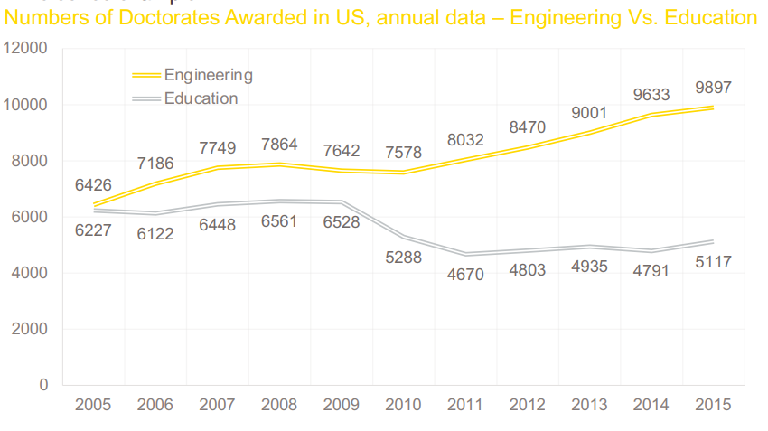
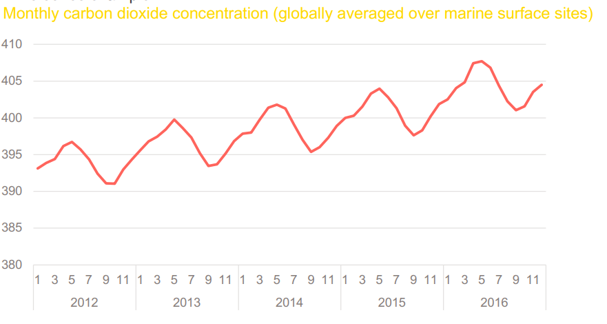
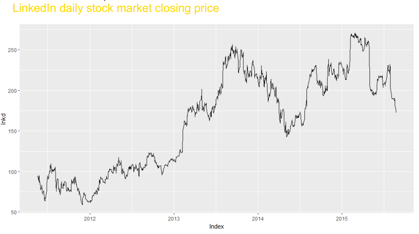
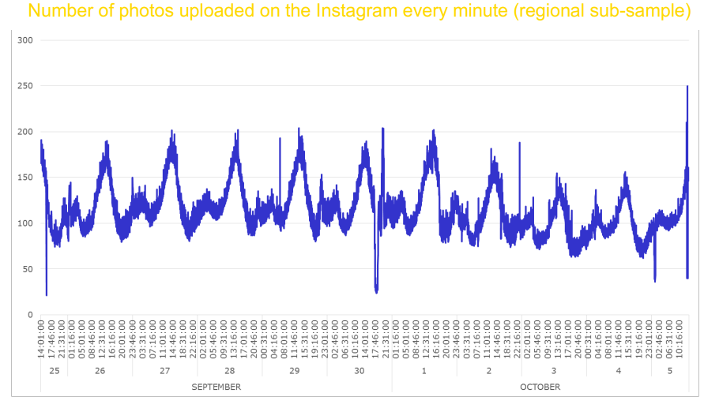
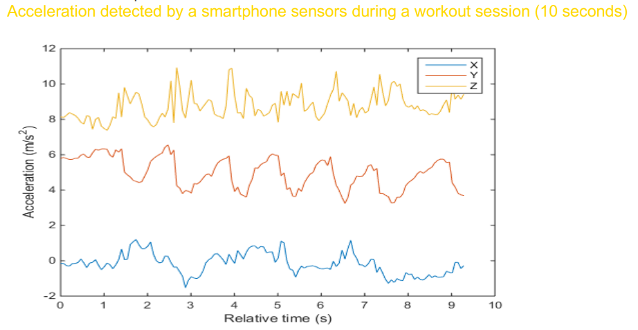

# Cross Sectional vs. Time Series Data

-   Cross Sectional Data: Multiple objects observed at a particular point of time

# Cross Sectional vs. Time Series Data

-   Cross Sectional Data: Multiple objects observed at a particular point of time

-   Examples: customers' behavioral data at today's update,companies' account balances at the end of the last year,patients' medical records at the end of the current month.

# Cross Sectional vs. Time Series Data

-   Time Series Data: One single object (product, country, sensor, ..) observed over multiple equally-spaced time periods

# Cross Sectional vs. Time Series Data

-   Time Series Data: One single object (product, country, sensor, ..) observed over multiple equally-spaced time periods

-   Examples: quarterly Italian GDP of the last 10 years, weekly supermarket sales of the previous year, yesterday's hourly temperature measurements.

# Examples



# Examples



# Examples



# Examples



# Examples



# Examples


::: {.cell}
::: {.cell-output-display}

:::
:::


# What to do with time series?

-   Understanding of specific series features or pattern

-   Forecasting

# 


```{=tex}
\begin{center}
\Huge Smoothing
\end{center}
```

# Smoothing

-   Smoothing is usually done to reveal the series patterns and trends.

# Simple Moving Average Smoothing

-   Moving Average (MA) creates a new series by averaging the most recent observations from the original series.

-   MA(k) creates $s_t$ as follows.

$$
s_{t} = \frac{y_t + y_{t-1} +...+ y_{t-k+1}}{k}
$$

-   Larger $k$ will smooth the series more strongly

# 


::: {.cell}
::: {.cell-output-display}

:::
:::


# 


::: {.cell}
::: {.cell-output-display}

:::
:::


# 


::: {.cell}
::: {.cell-output-display}

:::
:::


# 


::: {.cell}
::: {.cell-output-display}

:::
:::


# 


::: {.cell}
::: {.cell-output-display}

:::
:::


# 


::: {.cell}
::: {.cell-output-display}

:::
:::


# 


::: {.cell}
::: {.cell-output-display}

:::
:::


# 


::: {.cell}
::: {.cell-output-display}

:::
:::


# 


::: {.cell}
::: {.cell-output-display}

:::
:::


# Forecasting

-   We can use MA smoothing for forecasting

-   We have \begin{align*}
    \hat{s}_t &= \frac{y_t + y_{t-1} +...+ y_{t-k+1}}{k}\\
    &=\frac{y_t + y_{t-1} +...+ y_{t-k+1}+y_{t-k}-y_{t-k}}{k}\\
    &=\frac{y_t + \bigg(y_{t-1} +...+ y_{t-k+1}+y_{t-k}\bigg)-y_{t-k}}{k}\\
    &= \frac{y_t + k\hat{s}_{t-1}-y_{t-k}}{k}\\
    &= \hat{s}_{t-1} + \frac{y_t-y_{t-k}}{k}
    \end{align*}

# Forecasting

-   If there is no trend in $y_t$ the second term $(y_t-y_{t-k})/k$ can be ignored
-   Forecasting $l$ lead time into future by

$$
\hat{y}_{T+l} = \hat{s}_T
$$

-   If there is a linear trend in a series, we can use the double moving average to estimate the trend (slope)

# 


```{=tex}
\begin{center}
\Huge Double MA
\end{center}
```

# Double MA

-   Linear trend time series: $$
    y_t = \beta_0 + \beta_1t +\epsilon_t
    $$

-   Step 1: MA Smooth the series $$
    \hat{s}^{(1)}_{t} = \frac{y_t + y_{t-1} +...+ y_{t-k+1}}{k}
    $$

-   Step 2: MA Smooth the smoothed series $$
    \hat{s}^{(2)}_{t} = \frac{\hat{s}^{(1)}_t + \hat{s}^{(1)}_{t-1} +...+ \hat{s}^{(1)}_{t-k+1}}{k}
    $$

-   Step 3: Calculate the linear trend/slope $$
    b_1 = \hat{\beta_1} =  \frac{2}{k-1}\bigg(\hat{s}_T^{(1)}-\hat{s}_T^{(2)}\bigg)
    $$

# Forecasting

-   Forecasting $l$ lead time into future by $$
    \hat{y}_{T+l} = \hat{s}^{(1)}_T + b_1 \cdot l
    $$

# 

You are given the following time series

| $t$   | 1   | 2   | 3   | 4   | 5   |
|:------|:----|:----|:----|:----|:----|
| $y_t$ | 1   | 3   | 5   | 8   | 13  |

-   Forecasting $y_{6}$ using simple moving average with $k = 2$

-   Forecasting $y_{6}$ using double moving average with $k = 2$

# 

# Example

-   We simulate 100 data points ($T=100$) of $$
    y_t = 1 +3t + \epsilon, 
    $$ where, $\epsilon \sim N(0, 5^2)$.

# 


::: {.cell}
::: {.cell-output-display}

:::
:::


# 


::: {.cell}
::: {.cell-output-display}

:::
:::


# 


::: {.cell}
::: {.cell-output-display}

:::
:::


# 

-   Using the above steps, the estimated trend is $b_1 = 2.92$

-   The forecast for the next points from $y_{100}$ is

$$
    \hat{y}_{100+l} = \hat{s}_{100}+ b_1\cdot l = \hat{s}_{100}+ 2.92\cdot l
$$

